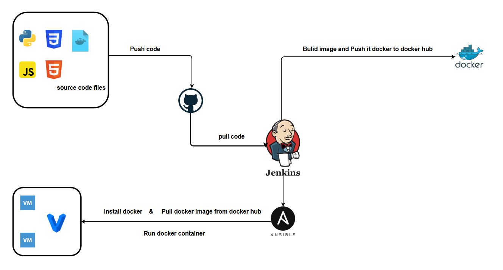

# Weather App Deployment with Jenkins, Docker, and Ansible

This project automates the deployment of a Python-based Weather App using Jenkins, Docker, and Ansible. The CI/CD pipeline pulls the latest code from GitHub, builds a Docker image, pushes it to Docker Hub, and deploys it on virtual machines using Ansible.

## Project diagram

##CI/CD Pipeline
The Jenkins pipeline (jenkinsfile) consists of the following stages:
1. Checkout Code: Pulls the latest code from the GitHub repository.
2. Build Docker Image: Creates a Docker image for the Weather App.
3. Push Docker Image: Uploads the built image to Docker Hub.
4. Deploy with Ansible: Uses Ansible to pull the image and run a container on the target machines.
5. Email Notifications: Sends an email upon build success or failure.

