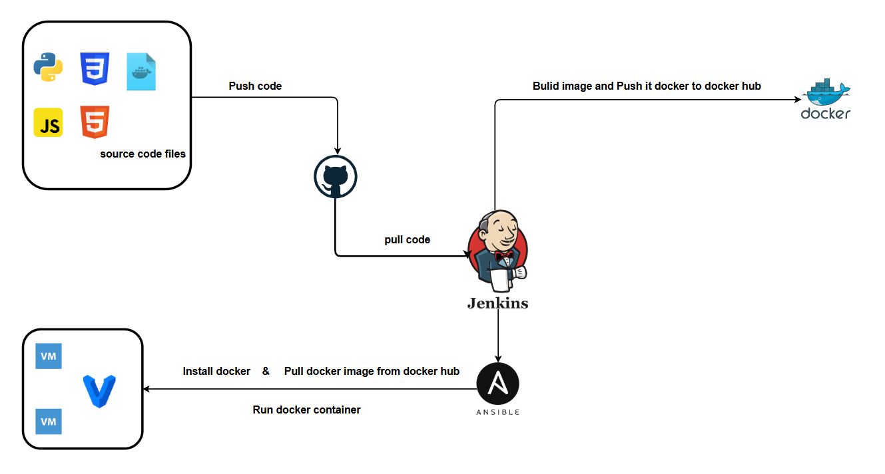

# Weather App Deployment with Jenkins, Docker, and Ansible

This project automates the deployment of a Python-based Weather App using Jenkins, Docker, and Ansible. The CI/CD pipeline pulls the latest code from GitHub, builds a Docker image, pushes it to Docker Hub, and deploys it on virtual machines using Ansible.

## Project diagram

