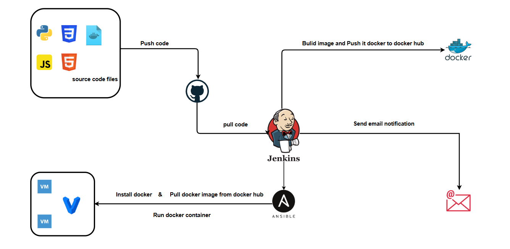
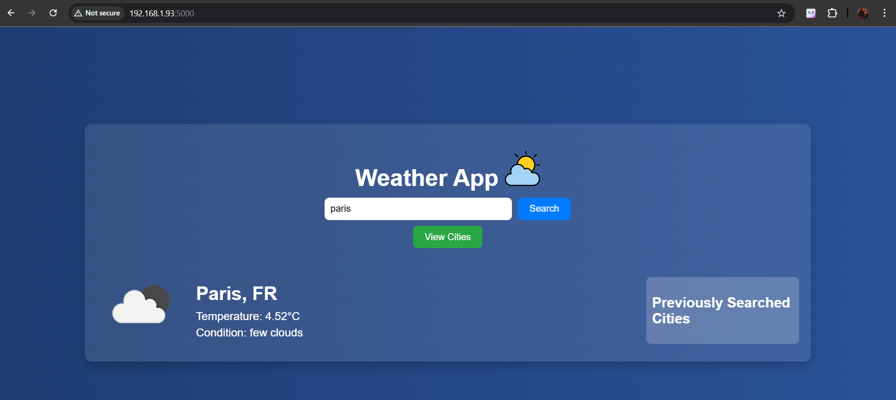
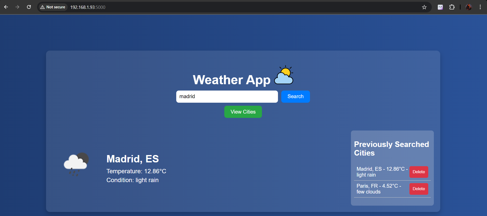
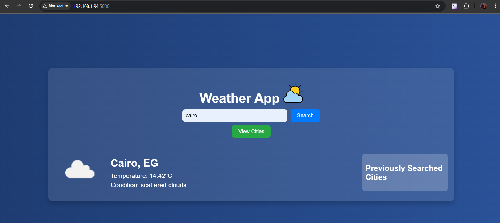
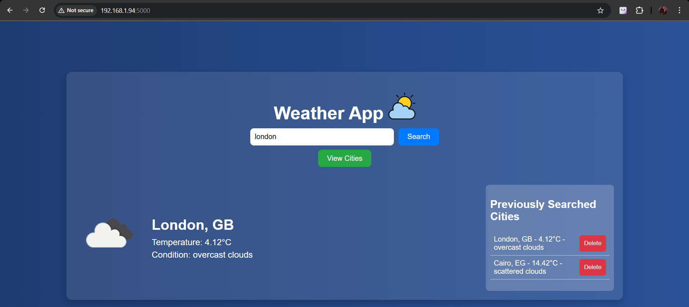
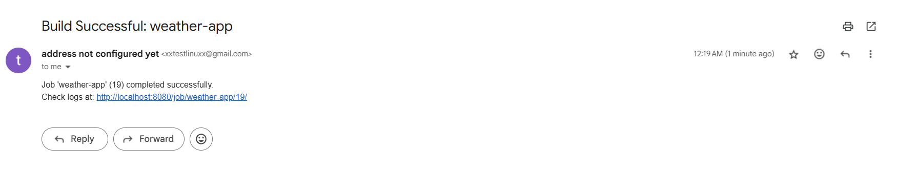

# Weather App Deployment with Jenkins, Docker, and Ansible

This project automates the deployment of a Python-based Weather App using Jenkins, Docker, and Ansible. The CI/CD pipeline pulls the latest code from GitHub, builds a Docker image, pushes it to Docker Hub, and deploys it on virtual machines using Ansible.

## Project diagram

## CI/CD Pipeline
The Jenkins pipeline (jenkinsfile) consists of the following stages:
1. Checkout Code: Pulls the latest code from the GitHub repository.
2. Build Docker Image: Creates a Docker image for the Weather App.
3. Push Docker Image: Uploads the built image to Docker Hub.
4. Deploy with Ansible: Uses Ansible to pull the image and run a container on the target machines.
5. Email Notifications: Sends an email upon build success or failure.

### Ensure Jenkins has:

- Credentials for GitHub (jenkins-github-token)
- Credentials for Docker Hub (jenkins-dockerhub-token)
- SSH agent configured for Ansible nodes (vagrant-vm1, vagrant-vm2)

## Output

After successful deployment, the Weather App will be running on the target virtual machines. Below is a screenshot of the deployed application

|  |  |
|----------------------|----------------------|
|  |  |

## Email Notifications

The Jenkins pipeline includes email notifications to inform developers about the status of the build. Upon successful deployment, an email is sent with a success message. If the build fails, an email is sent with failure details to help with debugging.
### example 

